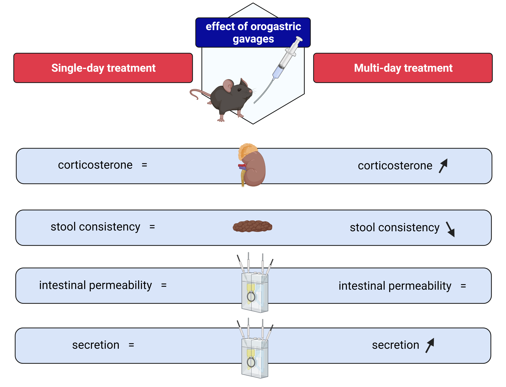

## Single-day and multi-day exposure to orogastric gavages do not affect intestinal barrier function in mice

#### Nikita Hanning, Rosanne Verboven, Joris G. De Man, Hannah Ceuleers, Heiko U. De Schepper, Annemieke Smet and Benedicte Y. De Winter

### Abstract
**Aims:** Animals involved in common laboratory procedures experience minor levels of stress. The direct effect of limited amounts of stress on gastrointestinal function has not been reported yet. Therefore, this study aimed to assess the effect of single-day and multi-day orogastric gavages on gut physiology in mice.

**Main methods:** Twelve-week old female C57Bl6/J mice were randomized to receive a treatment with sterile water (200 µL) delivered by orogastric gavages twice daily for a total of 1 or 10 day(s). Control animals did not receive any treatment. Subsequently, gastrointestinal function was assessed by measuring fecal pellet production. Furthermore, ex vivo intestinal barrier and secretory function of the distal colon, proximal colon and terminal ileum were quantified in Ussing chambers.

**Key findings:** In mice, single-day gavages did not influence corticosterone levels nor gastrointestinal function. In mice exposed to multi-day gavages, corticosterone levels were slightly but significantly increased compared to controls after 10 days of treatment. Gastrointestinal motor function was altered, as evidenced by increased fecal pellet counts and a small increase in fecal water content. However, exposure to repeated gavages did not lead to detectable alterations in gastrointestinal barrier function as quantified by the paracellular flux of the probe 4kDa FITC-dextran as well as transepithelial resistance measurements.

**Significance:** The administration of drugs via single-day or multi-day orogastric gavages leads to no or minor stress in mice, respectively. In both cases, it does not hamper the study of the intestinal barrier function and therefore remains a valuable administration route in preclinical pharmacological research.

### Graphical abstract

### More information?
- benedicte.dewinter@uantwerpen.be
- nikita.hanning@uantwerpen.be
